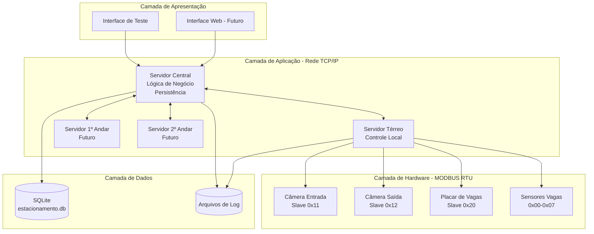
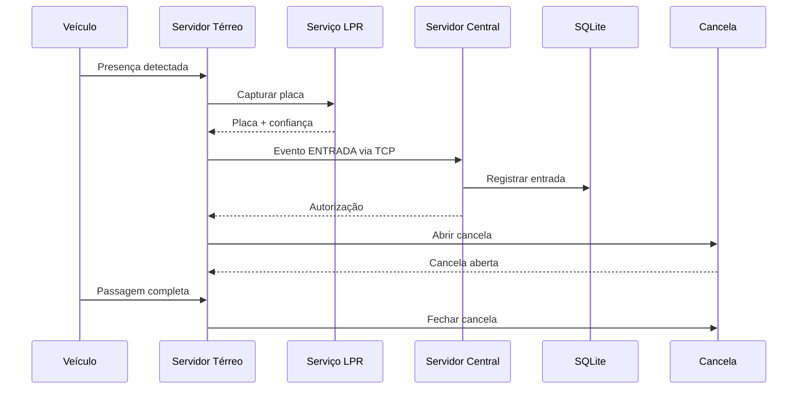
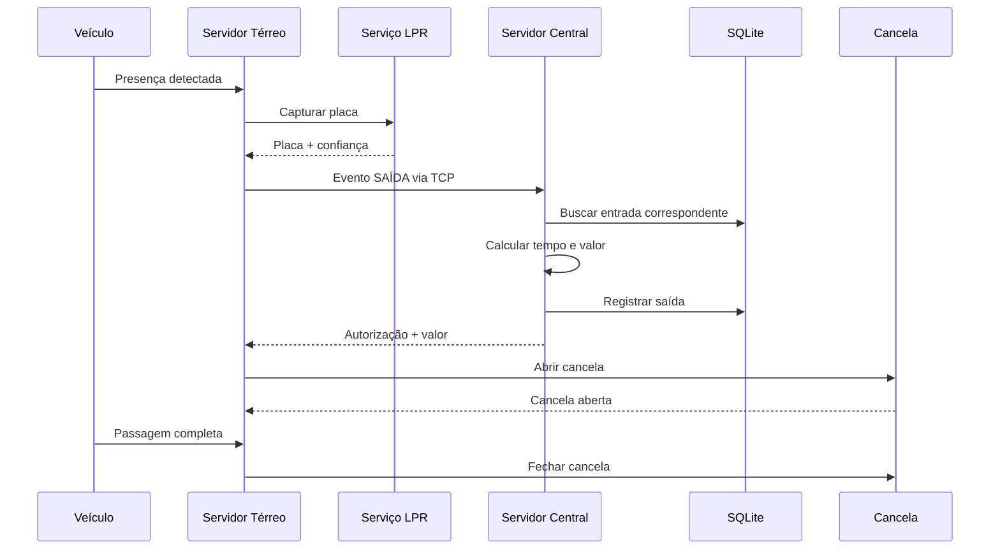

# Arquitetura do Sistema de Estacionamento Distribuído

## Visão Geral

O Sistema de Estacionamento Distribuído foi projetado com uma arquitetura modular e escalável, utilizando comunicação TCP/IP entre servidores distribuídos e protocolo MODBUS RTU para comunicação com hardware industrial.

## Objetivos Arquiteturais

- **Distribuição**: Cada andar possui seu próprio servidor de controle
- **Centralização**: Servidor central gerencia lógica de negócio e persistência
- **Escalabilidade**: Facilmente expansível para novos andares
- **Confiabilidade**: Comunicação robusta e tratamento de erros
- **Modularidade**: Componentes independentes e reutilizáveis

## Arquitetura Geral



## Protocolos de Comunicação

### TCP/IP (Servidores)
- **Protocolo**: TCP sobre IP
- **Formato**: JSON
- **Encoding**: UTF-8
- **Porta padrão**: 8080
- **Comunicação**: Assíncrona (asyncio)

### MODBUS RTU (Hardware)
- **Interface**: RS485
- **Velocidade**: 9600 bps (configurável)
- **Paridade**: None
- **Data bits**: 8
- **Stop bits**: 1

## Componentes Principais

### 1. Servidor Central (`src/core/servidor_central.py`)

**Responsabilidades:**
- Gerenciamento da lógica de negócio
- Cálculos de tempo e valor
- Persistência de dados em SQLite
- Coordenação entre servidores distribuídos
- Geração de relatórios e estatísticas

**Funcionalidades:**
```python
class ServidorCentral:
    - iniciar_servidor()           # Inicia servidor TCP
    - _handle_cliente()            # Gerencia conexões TCP
    - _processar_evento()          # Processa eventos de entrada/saída
    - _calcular_valor()            # Calcula valor do estacionamento
    - _buscar_entrada()            # Busca entrada correspondente
    - obter_estatisticas()         # Retorna estatísticas do sistema
```

### 2. Servidor Térreo (`src/core/servidor_terreo.py`)

**Responsabilidades:**
- Controle local de cancelas e sensores
- Comunicação com hardware via MODBUS
- Captura de placas via LPR
- Máquinas de estado para fluxo de entrada/saída
- Envio de eventos ao servidor central

**Máquinas de Estado:**
```python
class EstadoCancela(Enum):
    AGUARDANDO          # Aguardando veículo
    DETECTOU_VEICULO    # Presença detectada
    CAPTURANDO_PLACA    # LPR em operação
    COMUNICANDO_CENTRAL # Enviando ao central
    ABRINDO_CANCELA     # Abrindo cancela
    AGUARDANDO_PASSAGEM # Aguardando saída do sensor
    FECHANDO_CANCELA    # Fechando cancela
    ERRO                # Estado de erro
```

### 3. Modelos de Dados

#### Evento (`src/core/models/evento.py`)
```python
class Evento:
    id: str
    placa: str
    tipo: TipoEvento           # ENTRADA, SAIDA, ERRO, MANUTENCAO
    timestamp: datetime
    confianca_lpr: float       # 0.0 - 1.0
    andar: str                 # "terreo", "andar1", "andar2"
    status: StatusEvento       # PENDENTE, PROCESSANDO, CONCLUIDO, ERRO
    valor_calculado: float     # Valor calculado (apenas saída)
    tempo_permanencia_minutos: int
    erro_descricao: str
```

#### Veículo (`src/core/models/veiculo.py`)
```python
class Veiculo:
    placa: str
    entrada: datetime
    saida: datetime
    andar: str
    valor_calculado: float
    tempo_permanencia_minutos: int
```

### 4. Serviços

#### LPR Service (`src/core/services/lpr_service.py`)
- Simulação de reconhecimento de placas
- Geração de placas aleatórias em modo simulação
- Interface preparada para integração com câmeras reais

#### Cancela Service (`src/core/services/cancela_service.py`)
- Controle de cancelas de entrada e saída
- Detecção de presença via sensores
- Comunicação MODBUS para atuadores

#### Placar Service (`src/core/services/placar_service.py`)
- Atualização do placar de vagas
- Monitoramento de sensores de ocupação
- Cálculo de vagas disponíveis

### 5. Cliente MODBUS (`src/clients/modbus_client.py`)

**Funcionalidades:**
- Comunicação serial RS485
- Implementação do protocolo MODBUS RTU
- Modo simulação para desenvolvimento
- Tratamento de timeouts e erros

## Modelo de Dados

### Esquema SQLite

```sql
-- Tabela de eventos
CREATE TABLE eventos (
    id TEXT PRIMARY KEY,
    placa TEXT NOT NULL,
    tipo TEXT NOT NULL,             -- 'entrada', 'saida', 'erro'
    timestamp DATETIME NOT NULL,
    confianca_lpr REAL,
    andar TEXT,
    status TEXT,                    -- 'pendente', 'processando', 'concluido', 'erro'
    valor_calculado REAL,
    tempo_permanencia_minutos INTEGER
);

-- Índices para performance
CREATE INDEX idx_placa ON eventos(placa);
CREATE INDEX idx_timestamp ON eventos(timestamp);
CREATE INDEX idx_tipo ON eventos(tipo);
```

## Fluxos de Operação

### Fluxo de Entrada



### Fluxo de Saída



## Configurações

### Variáveis de Ambiente

```env
# Comunicação TCP/IP
CENTRAL_HOST=localhost
CENTRAL_PORT=8080

# MODBUS RTU
SERIAL_PORT=/dev/ttyUSB0
MODBUS_BAUDRATE=9600
MODBUS_TIMEOUT=1.0

# Endereços MODBUS
MODBUS_ADDRESS_ENTRADA=1
MODBUS_ADDRESS_SAIDA=2
MODBUS_ADDRESS_PLACAR=3

# Banco de dados
DB_PATH=data/estacionamento.db

# Lógica de negócio
PRECO_POR_MINUTO=0.15
VALOR_MINIMO=2.00
TOTAL_VAGAS=8

# Operação
MODE=simulation  # simulation | hardware
LPR_TIMEOUT=5
LPR_CONFIDENCE_MIN=0.8
```

### Endereçamento MODBUS

| Dispositivo | Endereço | Tipo | Função |
|-------------|----------|------|---------|
| Cancela Entrada | 0x01 | Coil | Abrir/Fechar |
| Cancela Saída | 0x02 | Coil | Abrir/Fechar |
| Placar Vagas | 0x03 | Holding Register | Atualizar display |
| Sensor Vaga 0 | 0x00 | Input Register | Status ocupação |
| Sensor Vaga 1 | 0x01 | Input Register | Status ocupação |
| ... | ... | ... | ... |
| Sensor Vaga 7 | 0x07 | Input Register | Status ocupação |

## Padrões de Design

### 1. **Arquitetura em Camadas**
- Separação entre lógica de negócio, comunicação e hardware
- Cada camada tem responsabilidades bem definidas

### 2. **Padrão Observer**
- Servidores distribuídos notificam o central sobre eventos
- Central coordena ações baseado nos eventos

### 3. **State Machine**
- Máquinas de estado para controle de cancelas
- Estados bem definidos para cada operação

### 4. **Factory Pattern**
- Criação de eventos e veículos
- Abstração da criação de objetos

### 5. **Strategy Pattern**
- Diferentes estratégias para modo simulação vs hardware
- Permite troca de implementação sem alterar lógica

## Tratamento de Erros

### Tipos de Erro
1. **Comunicação TCP**: Timeout, conexão perdida
2. **MODBUS**: Falha de comunicação, dispositivo não responde
3. **LPR**: Placa não reconhecida, baixa confiança
4. **Banco de dados**: Falha de escrita, corrupção
5. **Hardware**: Cancela travada, sensor com defeito

### Estratégias de Recuperação
- **Retry automático** com backoff exponencial
- **Fallback** para modo manual em caso de falha
- **Logging detalhado** para debugging
- **Estados de erro** explícitos nas máquinas de estado

## Escalabilidade

### Adição de Novos Andares
1. Criar novo servidor distribuído (cópia do térreo)
2. Configurar endereços MODBUS únicos
3. Registrar no servidor central
4. Testar comunicação e fluxos

### Balanceamento de Carga
- Servidor central pode distribuir requisições
- Cada andar opera independentemente
- Failover automático em caso de falha

## Monitoramento e Logs

### Níveis de Log
- **DEBUG**: Comunicação MODBUS detalhada
- **INFO**: Eventos normais do sistema
- **WARNING**: Situações anômalas mas recuperáveis
- **ERROR**: Falhas que requerem intervenção
- **CRITICAL**: Falhas que impedem operação

### Métricas Coletadas
- Tempo de resposta TCP/IP
- Taxa de sucesso LPR
- Uptime dos servidores
- Estatísticas de ocupação
- Receita por período

---

**Documento**: Arquitetura do Sistema  
**Versão**: 1.0  
**Data**: 16 de setembro de 2025  
**Autor**: Sistema de Estacionamento Distribuído
